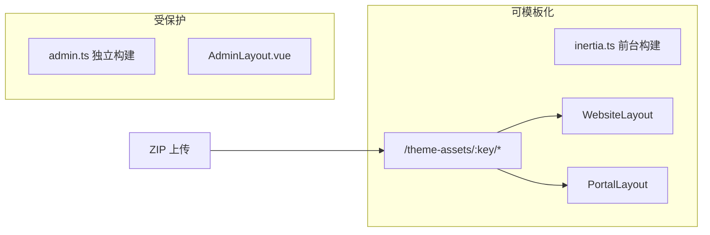

# McWeb 前台模板系统

通过上传 ZIP 压缩包，快速更换**官网**与**用户前台**（论坛/商城）的外观，无需重新构建前端。

> **正式规范**：详见 [TEMPLATE_SPEC.md](./TEMPLATE_SPEC.md)（契约、作用范围、能力边界）。
>
> **重要**：模板系统仅影响官网与用户前台。后台 Admin 使用独立的 `admin.ts` 前端入口，**绝不会**被模板修改。

## 快速开始

1. 下载示例包：[starter.zip](/template-starter/starter.zip)（或参考 `public/template-starter/` 目录自行打包）
2. 登录后台 → **官网** → **前台模板**
3. 上传 ZIP，点击「激活官网」或「激活前台」
4. 访问首页或论坛验证效果

本地构建示例包：

```bash
bin/build-starter-template
```

## ZIP 包结构

根目录必须包含 `manifest.json`：

```
my-theme.zip
├── manifest.json
├── styles/
│   └── theme.css
├── assets/
│   ├── logo.svg
│   └── favicon.ico
└── slots/
    ├── website_header.html
    ├── website_footer.html
    └── portal_header_extra.html
```

### manifest.json 字段

| 字段 | 必填 | 说明 |
|------|------|------|
| `name` | 是 | 模板显示名称 |
| `key` | 是 | 唯一标识，小写字母/数字/连字符 |
| `version` | 是 | 语义化版本，如 `1.0.0` |
| `scopes` | 是 | `website`、`portal` 或两者 |
| `tokens` | 否 | CSS 变量，注入为 `--template-{name}` |
| `assets.css` | 否 | 自定义 CSS 文件路径数组 |
| `assets.logo` | 否 | Logo 图片路径 |
| `assets.favicon` | 否 | 网站图标路径 |
| `slots.*` | 否 | HTML 插槽，须位于 `slots/` 且为 `.html` |

### 允许的文件类型

`.css` `.json` `.png` `.jpg` `.jpeg` `.svg` `.webp` `.gif` `.woff` `.woff2` `.html`（仅 slots 目录）

### 禁止的内容

- `.vue` `.js` `.ts` `.rb` `.erb` 等可执行/源码文件
- 路径含 `admin`、`Admin`、`pages/Admin`
- 路径穿越（`..`）
- `scopes` 包含 `admin`

## CSS 变量（tokens）

manifest 中的 `tokens` 会作为内联样式注入布局根元素：

```json
{
  "tokens": {
    "primary_color": "#38bdf8",
    "website_bg": "#0f172a"
  }
}
```

在自定义 CSS 中使用：

```css
.website-page {
  background: var(--template-website-bg);
}
```

## HTML 插槽

| 插槽名 | 作用范围 | 说明 |
|--------|----------|------|
| `website_header` | 官网 | 替换默认页眉（消毒后渲染） |
| `website_footer` | 官网 | 替换默认页脚 |
| `portal_header_extra` | 用户前台 | 在主栏上方插入额外 HTML |

插槽 HTML 经服务端白名单消毒，禁止 `<script>`、`<iframe>` 等。

## 预览

后台点击「预览官网/前台」，或在 URL 添加 `?preview_template=模板key`（仅当前会话有效）。

## 部署配置

环境变量：

```bash
MCWEB_TEMPLATE_DIR=/var/lib/mcweb/templates
```

`bin/install` 会自动创建该目录。模板文件存储在数据目录，**不会**写入应用 release 目录或 `public/vite`。

## 安全架构



- Admin 与前台使用**独立 Vite 入口**（`admin.ts` / `inertia.ts`）
- 模板静态资源通过只读路由 `/theme-assets/:key/*` 提供
- 后台管理界面仅用于上传/激活，自身 UI 不受模板影响

## 权限

需要 `website.templates.manage` 权限（网站编辑角色默认包含）。
